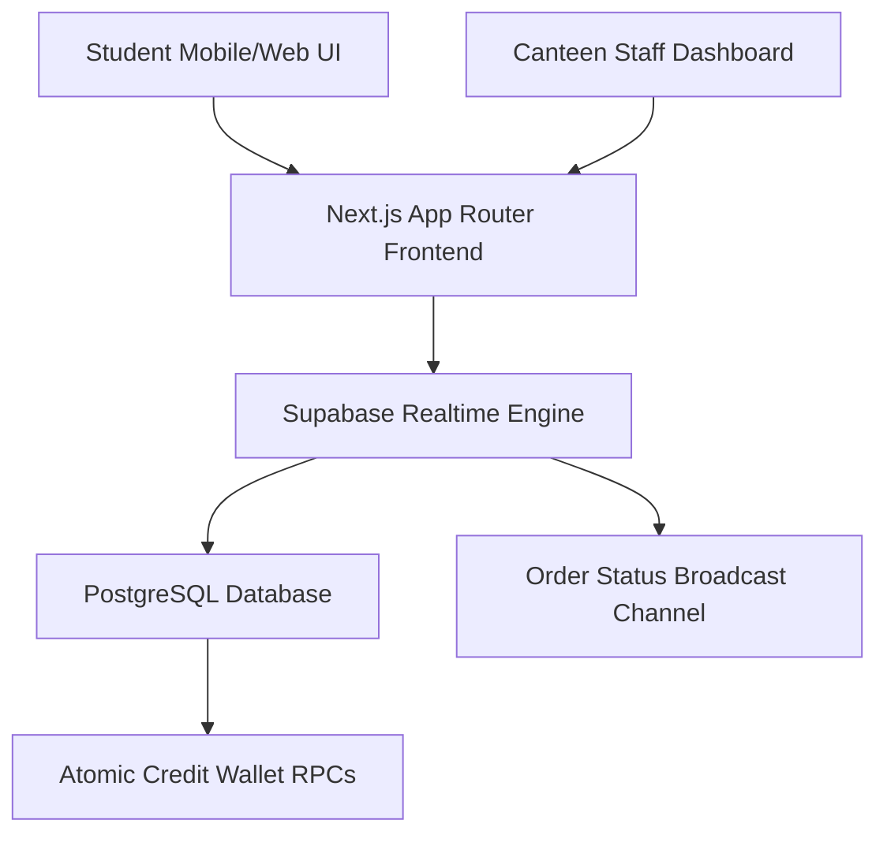

# 🍽️ CMRIT Canteen: Unified Digital Ordering & Wallet System

[](https://nextjs.org)
[](https://supabase.com)
[](https://www.typescriptlang.org)
[](https://tailwindcss.com)
[](LICENSE)

**CMRIT Canteen** is a high-performance web application designed to eliminate lunch queues and streamline food service at CMR Institute of Technology. Students can pre-order meals directly from classrooms prior to peak rush hours using an in-app credit wallet system, enabling instant order fulfillment and automated ledger tracking.

---

## 🌟 Key Features

* **Pre-Ordering for Peak Hour Elimination**: Allows students to order ahead from classrooms, selecting pick-up time slots to avoid canteen queues.
* **In-App Digital Wallet**: Seamless credit-based ordering system that bypasses manual payment verification and transaction delays.
* **Real-Time Order Tracking**: Status pipeline (Placed ➔ In Preparation ➔ Ready for Pickup ➔ Fulfilled) powered by Supabase real-time subscriptions.
* **Canteen Staff Management Dashboard**: Real-time kitchen display unit (KDU) for canteen staff to update item availability and manage order queues.
* **Transactional Security**: PostgreSQL RPC functions ensuring strict transactional balance checks and zero double-spend anomalies.

---

## 🏗️ System Architecture



---

## 🛠️ Tech Stack

* **Framework**: Next.js 15 (App Router, Server Components, Server Actions)
* **Language**: TypeScript
* **Database & Auth**: Supabase (PostgreSQL, Row Level Security, Realtime Subscriptions)
* **Styling**: Tailwind CSS
* **Icons & Components**: Lucide React, Shadcn UI primitives

---

## 🚀 Getting Started

### Prerequisites
* Node.js 18.0 or higher
* npm or pnpm

### Setup & Local Development
```bash
# Clone repository
git clone https://github.com/dewernodecimal/cmrit-canteen.git
cd cmrit-canteen

# Install dependencies
npm install

# Configure environment variables (.env.local)
# NEXT_PUBLIC_SUPABASE_URL=your_supabase_url
# NEXT_PUBLIC_SUPABASE_ANON_KEY=your_supabase_anon_key

# Run development server
npm run dev
```
Navigate to `http://localhost:3000` to access the application.

---

## 📄 License
Distributed under the MIT License. See `LICENSE` for details.
